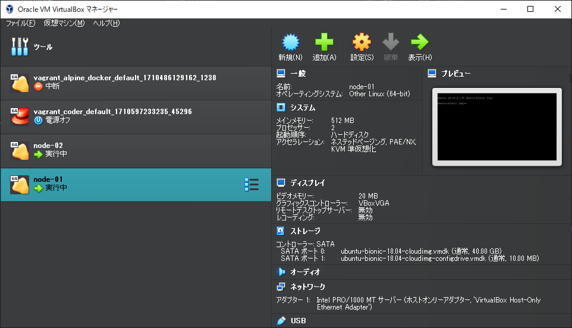

# terraform_virtualbox_example1

[GitHub - Terraform](https://github.com/hashicorp/terraform)  


[Deploying VMs in Virtualbox using Terraform Provider terrafarm/virtualbox](https://www.roksblog.de/terraform-virtualbox-provider-terrafarm/)  

[Install Terraform](https://developer.hashicorp.com/terraform/install)  


https://releases.hashicorp.com/terraform/1.7.5/terraform_1.7.5_windows_386.zip

```
> .\terraform.exe --version
Terraform v1.7.5
on windows_386
```

要 PATH 追加  
※VBoxManage.exe が見つからないとエラーになる上に途中まで作った VM がゾンビになる
```
$env:PATH = $env:PATH + ";C:\Program Files\Oracle\VirtualBox"
```

```
.\terraform.exe init
.\terraform.exe plan
.\terraform.exe apply
```

```
> .\terraform.exe init     

Initializing the backend...

Initializing provider plugins...
- Finding terra-farm/virtualbox versions matching "0.2.2-alpha.1"...
- Installing terra-farm/virtualbox v0.2.2-alpha.1...
- Installed terra-farm/virtualbox v0.2.2-alpha.1 (self-signed, key ID 51EC33490F8CDBE5)

Partner and community providers are signed by their developers.
If you'd like to know more about provider signing, you can read about it here: 
https://www.terraform.io/docs/cli/plugins/signing.html

Terraform has created a lock file .terraform.lock.hcl to record the provider   
selections it made above. Include this file in your version control repository 
so that Terraform can guarantee to make the same selections by default when    
you run "terraform init" in the future.

Terraform has been successfully initialized!

You may now begin working with Terraform. Try running "terraform plan" to see  
any changes that are required for your infrastructure. All Terraform commands  
should now work.

If you ever set or change modules or backend configuration for Terraform,      
rerun this command to reinitialize your working directory. If you forget, other
commands will detect it and remind you to do so if necessary.
```

```
> .\terraform.exe plan

Terraform used the selected providers to generate the following execution plan. Resource actions are indicated with the following symbols:
  + create

Terraform will perform the following actions:

  # virtualbox_vm.node[0] will be created
  + resource "virtualbox_vm" "node" {
      + cpus   = 2
      + id     = (known after apply)
      + image  = "https://app.vagrantup.com/ubuntu/boxes/bionic64/versions/20180903.0.0/providers/virtualbox.box"
      + memory = "512 mib"
      + name   = "node-01"
      + status = "running"

      + network_adapter {
          + device                 = "IntelPro1000MTServer"
          + host_interface         = "VirtualBox Host-Only Ethernet Adapter"
          + ipv4_address           = (known after apply)
          + ipv4_address_available = (known after apply)
          + mac_address            = (known after apply)
          + status                 = (known after apply)
          + type                   = "hostonly"
        }
    }

  # virtualbox_vm.node[1] will be created
  + resource "virtualbox_vm" "node" {
      + cpus   = 2
      + id     = (known after apply)
      + image  = "https://app.vagrantup.com/ubuntu/boxes/bionic64/versions/20180903.0.0/providers/virtualbox.box"
      + memory = "512 mib"
      + name   = "node-02"
      + status = "running"

      + network_adapter {
          + device                 = "IntelPro1000MTServer"
          + host_interface         = "VirtualBox Host-Only Ethernet Adapter"
          + ipv4_address           = (known after apply)
          + ipv4_address_available = (known after apply)
          + mac_address            = (known after apply)
          + status                 = (known after apply)
          + type                   = "hostonly"
        }
    }

Plan: 2 to add, 0 to change, 0 to destroy.

Changes to Outputs:
  + IPAddr   = (known after apply)
  + IPAddr_2 = (known after apply)

──────────────────────────────────────────────────────────────────────────────────────────────────────────────────────────────────────────────────────────────────────────────────────────────────────────────────────────────── 

Note: You didn't use the -out option to save this plan, so Terraform can't guarantee to take exactly these actions if you run "terraform apply" now.
```

```
> .\terraform.exe apply

Terraform used the selected providers to generate the following execution plan. Resource actions are indicated with the following symbols:
  + create

Terraform will perform the following actions:

  # virtualbox_vm.node[0] will be created    
  + resource "virtualbox_vm" "node" {
      + cpus   = 2
      + id     = (known after apply)
      + image  = "https://app.vagrantup.com/ubuntu/boxes/bionic64/versions/20180903.0.0/providers/virtualbox.box"
      + memory = "512 mib"
      + name   = "node-01"
      + status = "running"

      + network_adapter {
          + device                 = "IntelPro1000MTServer"
          + host_interface         = "VirtualBox Host-Only Ethernet Adapter"
          + ipv4_address           = (known after apply)
          + ipv4_address_available = (known after apply)
          + mac_address            = (known after apply)
          + status                 = (known after apply)
          + type                   = "hostonly"
        }
    }

  # virtualbox_vm.node[1] will be created
  + resource "virtualbox_vm" "node" {
      + cpus   = 2
      + id     = (known after apply)
      + image  = "https://app.vagrantup.com/ubuntu/boxes/bionic64/versions/20180903.0.0/providers/virtualbox.box"
      + memory = "512 mib"
      + name   = "node-02"
      + status = "running"

      + network_adapter {
          + device                 = "IntelPro1000MTServer"
          + host_interface         = "VirtualBox Host-Only Ethernet Adapter"
          + ipv4_address           = (known after apply)
          + ipv4_address_available = (known after apply)
          + mac_address            = (known after apply)
          + status                 = (known after apply)
          + type                   = "hostonly"
        }
    }

Plan: 2 to add, 0 to change, 0 to destroy.

Changes to Outputs:
  + IPAddr   = (known after apply)
  + IPAddr_2 = (known after apply)

Do you want to perform these actions?
  Terraform will perform the actions described above.
  Only 'yes' will be accepted to approve.

  Enter a value: yes

virtualbox_vm.node[1]: Creating...
virtualbox_vm.node[0]: Creating...
virtualbox_vm.node[1]: Still creating... [10s elapsed]
virtualbox_vm.node[0]: Still creating... [10s elapsed]
virtualbox_vm.node[0]: Still creating... [20s elapsed]
virtualbox_vm.node[1]: Still creating... [20s elapsed]
virtualbox_vm.node[1]: Still creating... [30s elapsed]
virtualbox_vm.node[0]: Still creating... [30s elapsed]
virtualbox_vm.node[0]: Still creating... [41s elapsed]
virtualbox_vm.node[1]: Still creating... [41s elapsed]
virtualbox_vm.node[0]: Still creating... [51s elapsed]
virtualbox_vm.node[1]: Still creating... [51s elapsed]
virtualbox_vm.node[0]: Still creating... [1m1s elapsed]
virtualbox_vm.node[1]: Still creating... [1m1s elapsed]
virtualbox_vm.node[0]: Still creating... [1m11s elapsed]
virtualbox_vm.node[1]: Still creating... [1m11s elapsed]
virtualbox_vm.node[0]: Still creating... [1m21s elapsed]
virtualbox_vm.node[1]: Still creating... [1m21s elapsed]
virtualbox_vm.node[1]: Creation complete after 1m23s [id=f12b7947-6748-4ce6-8bfe-3839eb003070]
virtualbox_vm.node[0]: Still creating... [1m31s elapsed]
virtualbox_vm.node[0]: Creation complete after 1m32s [id=118a4a98-f168-405c-886e-bc0a934e1866]

Apply complete! Resources: 2 added, 0 changed, 0 destroyed.

Outputs:

IPAddr = "192.168.56.101"
IPAddr_2 = "192.168.56.102"
```




```
> .\terraform.exe --help
Usage: terraform [global options] <subcommand> [args]

The available commands for execution are listed below.
The primary workflow commands are given first, followed by
less common or more advanced commands.

Main commands:
  init          Prepare your working directory for other commands
  validate      Check whether the configuration is valid
  plan          Show changes required by the current configuration
  apply         Create or update infrastructure
  destroy       Destroy previously-created infrastructure

All other commands:
  console       Try Terraform expressions at an interactive command prompt
  fmt           Reformat your configuration in the standard style
  force-unlock  Release a stuck lock on the current workspace
  get           Install or upgrade remote Terraform modules
  graph         Generate a Graphviz graph of the steps in an operation
  import        Associate existing infrastructure with a Terraform resource
  login         Obtain and save credentials for a remote host
  logout        Remove locally-stored credentials for a remote host
  metadata      Metadata related commands
  output        Show output values from your root module
  providers     Show the providers required for this configuration
  refresh       Update the state to match remote systems
  show          Show the current state or a saved plan
  state         Advanced state management
  taint         Mark a resource instance as not fully functional
  test          Execute integration tests for Terraform modules
  untaint       Remove the 'tainted' state from a resource instance
  version       Show the current Terraform version
  workspace     Workspace management

Global options (use these before the subcommand, if any):
  -chdir=DIR    Switch to a different working directory before executing the
                given subcommand.
  -help         Show this help output, or the help for a specified subcommand.
  -version      An alias for the "version" subcommand.
```